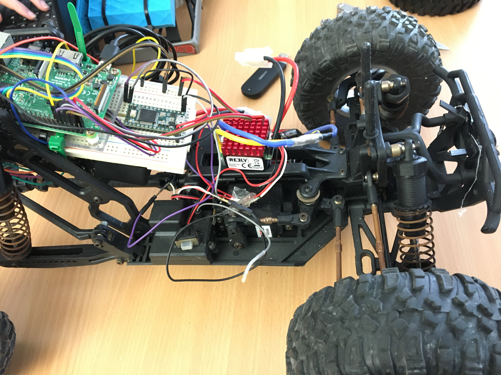

# Jacobs University Rover Robotics Platform (WIP)

The Jacobs University rover platform for robotics development. Contains the core ROS workspace for development of basic features. Currently a work in progress.



### Requirements

Requires a system with ROS melodic installed and Python 3. You can download and install ROS using your distro's package manager, or build from source as given [here](http://wiki.ros.org/melodic/Installation/Source).

### Installation

Using [catkin build tools](https://catkin-tools.readthedocs.io/en/latest/installing.html) as the build system:

```bash
git clone https://github.com/asadahmedde/jacobs-rover-core.git
cd jacobs-rover-core
catkin build
```

### Usage

Use the provided launch file to launch all core nodes:

```bash
roslaunch rover_core start_core.xml
```

**Note**: This repository will be updated as the rover ROS platform is currently a work in progress.
